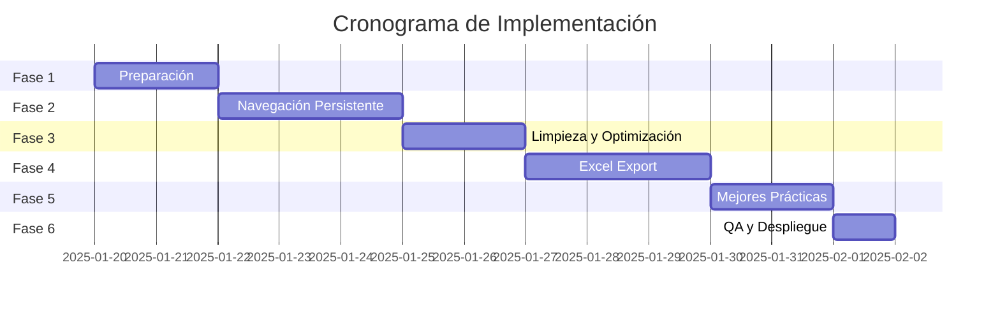

# 🗺️ ROADMAP DE IMPLEMENTACIÓN DETALLADO
## Sistema de Navegación Persistente y Optimización de Reportes

---

## 📊 VISTA GENERAL DEL PROYECTO



---

## 🏗️ FASE 1: PREPARACIÓN Y SETUP
**Duración: 2 días | Inicio: Día 1-2**

### 📋 Tareas Detalladas

#### Día 1: Setup Inicial
- [x] **T1.1** Crear branch `feature/nav-reports-optimization`
  ```bash
  git checkout -b feature/nav-reports-optimization
  ```

- [x] **T1.2** Configurar entorno de desarrollo
  - Instalar dependencias adicionales:
    ```bash
    npm install --save-dev @testing-library/jest-dom
    npm install node-cache redis
    ```
  - Configurar Redis local para caché

- [x] **T1.3** Documentar estado actual
  - Screenshots de navegación actual
  - Métricas de uso de `/start`
  - Samples de reportes actuales

- [x] **T1.4** Crear estructura de directorios
  ```
  src/
  ├── navigation/
  │   ├── NavigationManager.js
  │   ├── NavigationMiddleware.js
  │   └── __tests__/
  ├── repositories/
  │   ├── PolicyRepository.js
  │   └── __tests__/
  └── factories/
      ├── ReportFactory.js
      └── __tests__/
  ```

#### Día 2: Diseño y Mocks
- [x] **T1.5** Diseñar mockups de navegación
  - Menú persistente
  - Breadcrumbs
  - Botones contextuales

- [x] **T1.6** Crear templates de reportes
  - Diseño PDF mejorado
  - Estructura Excel multi-hoja

- [x] **T1.7** Setup de tests
  ```javascript
  // jest.config.js adicional
  testMatch: ['**/__tests__/**/*.test.js'],
  coverageThreshold: {
    global: {
      branches: 80,
      functions: 80,
      lines: 85
    }
  }
  ```

- [x] **T1.8** Crear fixtures de prueba
  - Datos de pólizas pendientes
  - Casos edge para testing

---

## 🧭 FASE 2: NAVEGACIÓN PERSISTENTE
**Duración: 3 días | Inicio: Día 3-5**

### 📋 Tareas Detalladas

#### Día 3: Core Navigation
- [x] **T2.1** Implementar NavigationManager
  ```javascript
  // src/navigation/NavigationManager.js
  class NavigationManager {
    constructor() {
      this.menuStack = new Map();
    }
    
    getMainMenu(userId) {
      // Retorna menú principal personalizado
    }
    
    pushContext(userId, context) {
      // Guarda contexto de navegación
    }
    
    getBreadcrumbs(userId) {
      // Genera breadcrumbs actuales
    }
  }
  ```

- [x] **T2.2** Crear NavigationMiddleware
  ```javascript
  // src/navigation/NavigationMiddleware.js
  const navigationMiddleware = async (ctx, next) => {
    const navManager = ctx.navManager;
    await next();
    
    // Agregar navegación a respuesta
    if (!ctx.navigationHandled) {
      await addNavigationMenu(ctx);
    }
  };
  ```

- [x] **T2.3** Modificar BaseCommand
  - Integrar NavigationManager
  - Agregar método `preserveNavigation()`
  - Update método `reply()` para incluir menú

#### Día 4: Integración con Comandos
- [x] **T2.4** Actualizar StartCommand
  - Remover limpieza de estados
  - Implementar menú sticky

- [x] **T2.5** Actualizar CommandHandler
  - Inyectar NavigationManager
  - Modificar callbacks principales

- [x] **T2.6** Actualizar handlers específicos
  - [x] PolicyHandler
  - [x] ServiceHandler
  - [x] ReportsHandler
  - [x] DatabaseHandler

- [x] **T2.7** Implementar "Volver al Menú"
  - Botón flotante en todas las respuestas
  - Preservar estado de navegación

#### Día 5: Testing Navegación
- [x] **T2.8** Tests unitarios NavigationManager
- [x] **T2.9** Tests integración middleware
- [x] **T2.10** Tests E2E flujo navegación
- [x] **T2.11** Validar con usuarios beta

---

## 🧹 FASE 3: LIMPIEZA Y OPTIMIZACIÓN
**Duración: 2 días | Inicio: Día 6-7**

### 📋 Tareas Detalladas

#### Día 6: Eliminación y Refactoring
- [x] **T3.1** Eliminar ReportPaymentCommand
  ```bash
  rm src/comandos/comandos/ReportPaymentCommand.js
  rm src/comandos/comandos/__tests__/ReportPaymentCommand.test.js
  ```

- [x] **T3.2** Limpiar referencias
  - CommandHandler.js: remover imports y registro
  - index.js: remover export
  - Menús: eliminar botón

- [x] **T3.3** Refactorizar menú reportes
  ```javascript
  // Solo dejar:
  [
    Markup.button.callback('📄 Pagos Pendientes PDF', 'accion:reportPaymentPDF'),
    Markup.button.callback('📊 Pagos Pendientes Excel', 'accion:reportPaymentExcel')
  ]
  ```

- [x] **T3.4** Optimizar PaymentReportPDFCommand
  - Implementar nuevo diseño
  - Agregar gráficos de resumen

#### Día 7: Mejoras PDF
- [x] **T3.5** Diseño visual mejorado
  ```javascript
  // Nuevos elementos:
  - Headers con color corporativo
  - Logos y branding
  - Gráfico de barras urgencia
  - Footer con metadata
  ```

- [x] **T3.6** Optimización de contenido
  - Compresión de streams
  - Fuentes embebidas optimizadas
  - Reducir metadata

- [x] **T3.7** Testing PDF
  - Validar con diferentes volúmenes
  - Verificar legibilidad
  - Test de impresión

---

## 📊 FASE 4: EXPORTACIÓN EXCEL
**Duración: 3 días | Inicio: Día 8-10**

### 📋 Tareas Detalladas

#### Día 8: Implementación Base
- [x] **T4.1** Crear PaymentReportExcelCommand
  ```javascript
  class PaymentReportExcelCommand extends BaseCommand {
    async generateExcel(pendingPolicies) {
      const workbook = new ExcelJS.Workbook();
      
      // Hoja 1: Resumen
      this.createSummarySheet(workbook, pendingPolicies);
      
      // Hoja 2: Detalle
      this.createDetailSheet(workbook, pendingPolicies);
      
      // Hoja 3: Análisis
      this.createAnalysisSheet(workbook, pendingPolicies);
    }
  }
  ```

- [x] **T4.2** Implementar hoja resumen
  - KPIs principales
  - Gráfico de distribución
  - Top 10 montos

- [x] **T4.3** Implementar hoja detalle
  - Todos los campos
  - Filtros automáticos
  - Formato condicional

#### Día 9: Funcionalidades Avanzadas
- [x] **T4.4** Implementar hoja análisis
  - Pivot table por aseguradora
  - Comparativas temporales
  - Tendencias

- [x] **T4.5** Agregar fórmulas
  ```javascript
  // Sumatorias automáticas
  worksheet.getCell('E' + lastRow).value = {
    formula: `SUM(E2:E${lastRow-1})`
  };
  ```

- [x] **T4.6** Estilos y formato
  - Colores corporativos
  - Bordes y sombreados
  - Ancho de columnas automático

#### Día 10: Integración y Testing
- [x] **T4.7** Integrar con menú
- [x] **T4.8** Streaming para grandes volúmenes
- [x] **T4.9** Tests con diferentes datasets
- [x] **T4.10** Validación de fórmulas

---

## 🚀 FASE 5: MEJORES PRÁCTICAS
**Duración: 2 días | Inicio: Día 11-12**

### 📋 Tareas Detalladas

#### Día 11: Patrones y Arquitectura
- [ ] **T5.1** Implementar PolicyRepository
  ```javascript
  class PolicyRepository {
    constructor(cacheManager) {
      this.cache = cacheManager;
    }
    
    async findPendingPayments(options = {}) {
      const cacheKey = `pending_${JSON.stringify(options)}`;
      
      // Check cache first
      const cached = await this.cache.get(cacheKey);
      if (cached) return cached;
      
      // Query database
      const result = await this.queryPendingPayments(options);
      
      // Cache result
      await this.cache.set(cacheKey, result, 300); // 5 min TTL
      
      return result;
    }
  }
  ```

- [ ] **T5.2** Implementar ReportFactory
- [ ] **T5.3** Error Boundaries
- [ ] **T5.4** Rate Limiting

#### Día 12: Optimización y Logs
- [ ] **T5.5** Implementar caché Redis
- [ ] **T5.6** Mejorar logging contextual
- [ ] **T5.7** Agregar métricas
- [ ] **T5.8** Documentación técnica

---

## 🧪 FASE 6: QA Y DESPLIEGUE
**Duración: 1 día | Inicio: Día 13**

### 📋 Tareas Detalladas

- [ ] **T6.1** Testing completo en staging
  - Flujos E2E
  - Pruebas de carga
  - Validación visual

- [ ] **T6.2** Performance testing
  - Medir tiempos de respuesta
  - Verificar memory leaks
  - Optimizar queries

- [ ] **T6.3** Documentación usuario
  - Guía de navegación
  - Manual de reportes
  - FAQ

- [ ] **T6.4** Preparar despliegue
  - Migration scripts
  - Rollback plan
  - Monitoreo

- [ ] **T6.5** Despliegue producción
  - Deploy gradual (canary)
  - Monitoreo en tiempo real
  - Validación post-deploy

---

## 📊 MÉTRICAS Y VALIDACIÓN

### Checkpoints por Fase

#### ✅ Fase 1 Completa cuando:
- [x] Todos los mocks aprobados
- [x] Ambiente de desarrollo listo
- [x] Tests base configurados

#### ✅ Fase 2 Completa cuando:
- [x] Navegación persistente funcionando
- [x] 0 necesidad de `/start` repetido
- [x] Tests pasando >95%

#### ✅ Fase 3 Completa cuando:
- [x] Comando lista eliminado
- [x] PDF optimizado <500KB promedio
- [x] Diseño aprobado por stakeholders

#### ✅ Fase 4 Completa cuando:
- [x] Excel generándose <3 segundos
- [x] 3 hojas con datos correctos
- [x] Fórmulas funcionando

#### ✅ Fase 5 Completa cuando:
- [ ] Cobertura tests >85%
- [ ] 0 code smells críticos
- [ ] Documentación completa

#### ✅ Fase 6 Completa cuando:
- [ ] 0 errores en producción
- [ ] Métricas dentro de SLA
- [ ] Usuarios satisfechos

---

## 🚨 PLAN DE CONTINGENCIA

### Si hay retrasos:
1. **Prioridad 1**: Navegación persistente (crítico)
2. **Prioridad 2**: Eliminación lista (limpieza)
3. **Prioridad 3**: Excel export (nueva feature)
4. **Prioridad 4**: Optimizaciones (nice to have)

### Rollback Strategy:
```bash
# Script de rollback preparado
./scripts/rollback-navigation.sh
```

---

## 📞 CONTACTOS Y RESPONSABLES

- **Tech Lead**: Responsable arquitectura
- **QA Lead**: Validación y testing
- **DevOps**: Despliegue y monitoreo
- **Product Owner**: Aprobación funcional

---

**Última actualización**: Enero 2025
**Versión**: 1.0.0