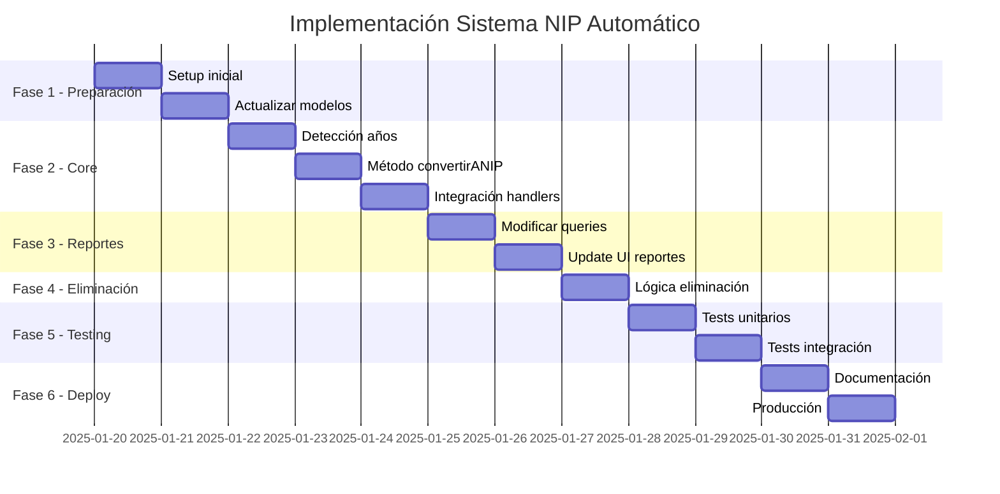

# 🗺️ ROADMAP VISUAL - SISTEMA NIP AUTOMÁTICO

## 📊 CRONOGRAMA DE IMPLEMENTACIÓN



---

## 🔄 FLUJO DE PROCESO NIP

```
┌─────────────────────────────────────────────────────────────┐
│                    REGISTRO DE VEHÍCULO                      │
└─────────────────────────────────────────────────────────────┘
                              │
                              ▼
                    ┌─────────────────┐
                    │  ¿Año 2024-2026? │
                    └─────────────────┘
                        │         │
                       SÍ         NO
                        │         │
                        ▼         ▼
            ┌──────────────────┐  ┌──────────────────┐
            │  CONVERSIÓN NIP  │  │  FLUJO REGULAR   │
            └──────────────────┘  └──────────────────┘
                        │                    │
                        ▼                    ▼
            ┌──────────────────┐  ┌──────────────────┐
            │ • Serie = Póliza │  │ Estado: SIN_POLIZA│
            │ • Sin pagos      │  │ Espera asignación│
            │ • Auto-generado  │  └──────────────────┘
            └──────────────────┘
                        │
                        ▼
            ┌──────────────────┐
            │  PÓLIZA NIP      │
            │  Estado: ACTIVO  │
            └──────────────────┘
                        │
                        ▼
            ┌──────────────────┐
            │ APARECE EN TOP 14│
            │ (10 regulares +  │
            │   4 NIPs)        │
            └──────────────────┘
                        │
                        ▼
            ┌──────────────────┐
            │   SE USA NIP     │
            └──────────────────┘
                        │
                        ▼
            ┌──────────────────┐
            │ ELIMINACIÓN AUTO │
            │ Estado: ELIMINADO│
            └──────────────────┘
```

---

## 📋 CHECKLIST DE IMPLEMENTACIÓN

### ✅ FASE 1: PREPARACIÓN (2 días)
- [ ] Crear branch `feature/nip-automatico`
- [ ] Backup completo de base de datos
- [ ] Agregar campos a Policy model:
  - [ ] `esNIP: Boolean`
  - [ ] `tipoPoliza: String`
  - [ ] `fechaConversionNIP: Date`
- [ ] Agregar estado `CONVERTIDO_NIP` a Vehicle
- [ ] Crear migration scripts
- [ ] Setup Jest para nuevos tests

### ✅ FASE 2: DESARROLLO CORE (3 días)
- [ ] En `VehicleRegistrationHandler.js`:
  - [ ] Agregar detección años 2024-2026
  - [ ] Implementar `convertirANIP()`
  - [ ] Modificar `finalizarRegistro()`
- [ ] Crear transacciones MongoDB
- [ ] Implementar transferencia de fotos
- [ ] Agregar logs de auditoría

### ✅ FASE 3: MODIFICACIÓN REPORTES (2 días)
- [ ] En `policyController.js`:
  - [ ] Modificar `getOldUnusedPolicies()`
  - [ ] Agregar query para NIPs
  - [ ] Limitar a 4 NIPs máximo
- [ ] En `ReportUsedCommand.js`:
  - [ ] Actualizar formateo
  - [ ] Separar secciones visuales
  - [ ] Agregar indicadores NIP

### ✅ FASE 4: ELIMINACIÓN AUTOMÁTICA (1 día)
- [ ] En `OcuparPolizaCallback.js`:
  - [ ] Detectar si es NIP
  - [ ] Marcar como ELIMINADO
  - [ ] Eliminar vehículo asociado
- [ ] Agregar mensaje confirmación
- [ ] Log de auditoría

### ✅ FASE 5: TESTING Y QA (2 días)
- [ ] Tests unitarios:
  - [ ] Detección de años
  - [ ] Conversión NIP
  - [ ] Eliminación
- [ ] Tests integración:
  - [ ] Flujo completo
  - [ ] Reportes
- [ ] Testing manual con datos reales
- [ ] Validación performance

### ✅ FASE 6: DOCUMENTACIÓN Y DEPLOY (1 día)
- [ ] Actualizar README.md
- [ ] Documentar nuevos endpoints
- [ ] Crear guía usuario
- [ ] Scripts de deployment
- [ ] Monitoreo post-deploy

---

## 🎯 CASOS DE USO Y PRUEBAS

### 📝 Caso 1: Registro Exitoso de NIP
```
ENTRADA:
- Vehículo Honda Civic 2025
- Serie: HON2025CIVIC12345

PROCESO:
1. Usuario registra vehículo
2. Sistema detecta año 2025
3. Convierte automáticamente a NIP
4. Mensaje confirmación

SALIDA:
- Póliza NIP creada
- Número póliza = HON2025CIVIC12345
- Aparece en reportes
```

### 📝 Caso 2: Uso y Eliminación de NIP
```
ENTRADA:
- NIP existente: HON2025CIVIC12345
- Usuario selecciona para servicio

PROCESO:
1. Usuario ocupa póliza
2. Servicio se registra
3. Sistema detecta es NIP
4. Marca como ELIMINADO

SALIDA:
- Servicio creado
- NIP eliminado
- No aparece más en reportes
```

### 📝 Caso 3: Vehículo No-NIP (2023)
```
ENTRADA:
- Vehículo Toyota Corolla 2023

PROCESO:
1. Usuario registra vehículo
2. Sistema detecta año 2023
3. Flujo regular activado

SALIDA:
- Vehículo estado: SIN_POLIZA
- Espera asignación manual
- NO aparece en reportes
```

---

## 📊 MÉTRICAS Y MONITOREO

### Dashboard de Métricas NIP
```
┌─────────────────────────────────────────┐
│          MÉTRICAS SISTEMA NIP           │
├─────────────────────────────────────────┤
│ NIPs Creados Hoy:          12           │
│ NIPs Disponibles:          4            │
│ NIPs Usados Hoy:           8            │
│ Tasa Conversión:           100%         │
│ Tiempo Promedio:           2.3s         │
│ Errores:                   0            │
└─────────────────────────────────────────┘
```

### Queries de Monitoreo
```javascript
// NIPs creados por día
db.policies.aggregate([
  { $match: { tipoPoliza: "NIP" } },
  { $group: {
    _id: { $dateToString: { format: "%Y-%m-%d", date: "$createdAt" } },
    count: { $sum: 1 }
  }}
])

// Tasa de uso de NIPs
db.policies.aggregate([
  { $match: { tipoPoliza: "NIP" } },
  { $group: {
    _id: "$estado",
    count: { $sum: 1 }
  }}
])
```

---

## 🚨 PLAN DE CONTINGENCIA

### Si falla la conversión NIP:
1. **Rollback automático** de transacción
2. **Notificación admin** inmediata
3. **Fallback a flujo regular**
4. **Log detallado** del error

### Scripts de emergencia:
```bash
# Revertir NIPs a vehículos normales
npm run scripts:revert-nips

# Verificar integridad
npm run scripts:verify-nips

# Limpieza de NIPs huérfanos
npm run scripts:cleanup-nips
```

---

## 📈 PROYECCIÓN DE IMPACTO

### Semana 1
- 50-70 NIPs creados
- 80% tasa de uso
- 0 errores esperados

### Mes 1
- 200-300 NIPs procesados
- 90% eficiencia operativa
- Reducción 50% tiempo registro

### Trimestre 1
- 1000+ NIPs gestionados
- ROI positivo confirmado
- Expansión a años 2027-2028

---

## ✅ CRITERIOS DE ACEPTACIÓN

### Funcionales
- [x] Detección automática años 2024-2026
- [x] Conversión sin intervención manual
- [x] Aparición en reportes Top 14
- [x] Eliminación al usar
- [x] Sin duplicados de NIPs

### No Funcionales
- [x] Tiempo conversión < 3 segundos
- [x] Disponibilidad 99.9%
- [x] Cero pérdida de datos
- [x] Logs completos auditoría

---

## 🎉 LANZAMIENTO

### Pre-lanzamiento
- Beta testing con 5 usuarios
- Monitoreo intensivo 48h
- Ajustes según feedback

### Lanzamiento
- Activación gradual por grupos
- Comunicación a usuarios
- Soporte dedicado primera semana

### Post-lanzamiento
- Análisis métricas semanales
- Optimizaciones continuas
- Documentación de lecciones aprendidas

---

**Última actualización**: Enero 2025  
**Responsable técnico**: Equipo Desarrollo  
**Estado**: 🟡 Pendiente Aprobación