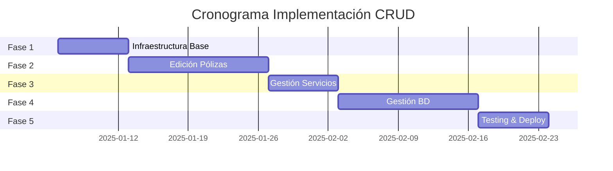

# 🗺️ ROADMAP SISTEMA CRUD - BOT DE PÓLIZAS

## 📋 RESUMEN EJECUTIVO

Implementación de sistema CRUD completo para administración del bot de pólizas vía Telegram, permitiendo gestión total de datos sin acceso directo al código.

**Duración estimada: 7 semanas**
**Inicio propuesto: Semana 1 - Enero 2025**

---

## 📊 VISIÓN GENERAL DE FASES

---

## 🏗️ FASE 1: INFRAESTRUCTURA BASE
**Duración: 1 semana (6-12 enero 2025)**
**Prioridad: ALTA**

### Objetivos:
- Establecer arquitectura base del sistema CRUD
- Implementar seguridad y control de acceso
- Configurar sistema de navegación y estados

### Tareas Detalladas:

#### 1.1 Sistema de Menús (2 días)
- [ ] Crear estructura de archivos para módulo admin
  - `src/admin/index.js` - Punto de entrada
  - `src/admin/menus/` - Definiciones de menús
  - `src/admin/handlers/` - Manejadores de acciones
- [ ] Implementar menú principal de administración
- [ ] Configurar navegación con breadcrumbs
- [ ] Sistema de botones inline dinámicos

#### 1.2 Control de Acceso (1 día)
- [ ] Implementar middleware `isAdmin()`
- [ ] Validación de permisos por grupo
- [ ] Manejo de sesiones admin
- [ ] Timeout de seguridad (5 min)

#### 1.3 Sistema de Estados (2 días)
- [ ] Extender `FlowStateManager` para admin
- [ ] Estados específicos para cada módulo
- [ ] Limpieza automática de estados
- [ ] Persistencia de contexto entre acciones

#### 1.4 Logging y Auditoría (2 días)
- [ ] Crear schema MongoDB para auditoría
- [ ] Logger específico para acciones admin
- [ ] Registro de cambios (antes/después)
- [ ] Sistema de alertas para acciones críticas

### Entregables:
- Menú administrativo funcional
- Sistema de autenticación implementado
- Logging básico operativo
- Documentación técnica inicial

---

## 📝 FASE 2: MÓDULO EDICIÓN DE PÓLIZAS
**Duración: 2 semanas (13-26 enero 2025)**
**Prioridad: ALTA**

### Objetivos:
- Implementar CRUD completo para pólizas
- Edición por categorías y campos específicos
- Sistema de eliminación/restauración lógica

### Tareas Detalladas:

#### 2.1 Edición por Categorías (4 días)
- [ ] Implementar menú de categorías:
  - Datos Personales
  - Domicilio
  - Vehículo
  - Datos de Póliza
  - Información Financiera
- [ ] Flujos de edición para cada campo
- [ ] Validaciones específicas por tipo
- [ ] Confirmación de cambios

#### 2.2 Sistema de Búsqueda (2 días)
- [ ] Búsqueda por número de póliza
- [ ] Búsqueda por titular/RFC
- [ ] Autocompletado inteligente
- [ ] Manejo de resultados múltiples

#### 2.3 Eliminación Lógica (2 días)
- [ ] Implementar estado 'ELIMINADO'
- [ ] Registro de fecha/motivo eliminación
- [ ] Exclusión de búsquedas activas
- [ ] Preservación de archivos R2

#### 2.4 Restauración de Pólizas (2 días)
- [ ] Listado de pólizas eliminadas
- [ ] Proceso de restauración
- [ ] Validaciones de integridad
- [ ] Notificación de restauración

#### 2.5 Testing y Refinamiento (4 días)
- [ ] Pruebas unitarias por módulo
- [ ] Pruebas de integración
- [ ] Casos edge y manejo de errores
- [ ] Optimización de flujos

### Entregables:
- CRUD completo para pólizas
- Sistema de búsqueda avanzada
- Eliminación/restauración funcional
- Suite de pruebas completa

---

## 🚗 FASE 3: MÓDULO GESTIÓN SERVICIOS
**Duración: 1 semana (27 enero - 2 febrero 2025)**
**Prioridad: MEDIA**

### Objetivos:
- Edición completa de servicios y registros
- Actualización de notificaciones programadas
- Manejo de casos especiales

### Tareas Detalladas:

#### 3.1 Edición de Servicios (3 días)
- [ ] Campos editables:
  - Número servicio, costo, fechas
  - Origen/destino, expediente
  - Horas notificación
- [ ] Actualización de notificaciones
- [ ] Recálculo de rutas si aplica
- [ ] Validaciones de negocio

#### 3.2 Edición de Registros (2 días)
- [ ] Campos específicos de registro
- [ ] Estados: PENDIENTE/ASIGNADO/NO_ASIGNADO
- [ ] Información de ruta
- [ ] Sincronización con servicios

#### 3.3 Casos Especiales (2 días)
- [ ] Servicios sin registro asociado
- [ ] Registros huérfanos
- [ ] Migración de datos legacy
- [ ] Consistencia de datos

### Entregables:
- Edición completa servicios/registros
- Notificaciones actualizadas automáticamente
- Manejo robusto de casos edge

---

## 💾 FASE 4: MÓDULO GESTIÓN BASE DE DATOS
**Duración: 2 semanas (3-16 febrero 2025)**
**Prioridad: MEDIA**

### Objetivos:
- Dashboard estadísticas en tiempo real
- Integración scripts existentes
- Herramientas de mantenimiento y optimización

### Tareas Detalladas:

#### 4.1 Dashboard Estadísticas (3 días)
- [ ] Métricas en tiempo real:
  - Total pólizas (activas/eliminadas)
  - Servicios (totales/mes/promedio)
  - Ingresos (totales/mensuales)
  - Notificaciones pendientes
- [ ] Caché para performance
- [ ] Actualización automática
- [ ] Exportación de reportes

#### 4.2 Integración Scripts (4 días)
- [ ] Ejecutar desde bot:
  - calculoEstadosDB.js
  - exportExcel.js
  - export.js
  - estados.js
- [ ] Manejo de errores y timeouts
- [ ] Notificación de progreso
- [ ] Logs de ejecución

#### 4.3 Importar/Exportar (3 días)
- [ ] Exportación completa (datos + archivos)
- [ ] Exportación solo Excel
- [ ] Importación desde Excel
- [ ] Validación de integridad
- [ ] Sincronización con R2

#### 4.4 Herramientas Mantenimiento (4 días)
- [ ] Limpieza de logs (>30 días)
- [ ] Verificación integridad:
  - Pólizas sin servicios
  - Servicios huérfanos
  - Archivos sin referencia
- [ ] Optimización BD:
  - Reindexación
  - Compactación
- [ ] Herramientas seguridad

### Entregables:
- Dashboard completo y funcional
- Scripts integrados al bot
- Sistema import/export robusto
- Suite completa de mantenimiento

---

## 🧪 FASE 5: TESTING Y DESPLIEGUE
**Duración: 1 semana (17-23 febrero 2025)**
**Prioridad: ALTA**

### Objetivos:
- Testing exhaustivo del sistema completo
- Documentación técnica y usuario
- Despliegue gradual y monitoreo

### Tareas Detalladas:

#### 5.1 Testing Integral (3 días)
- [ ] Pruebas de integración completas
- [ ] Pruebas de carga y stress
- [ ] Pruebas de seguridad
- [ ] Casos de uso reales
- [ ] Testing en ambiente staging

#### 5.2 Documentación (2 días)
- [ ] Manual de usuario administrador
- [ ] Documentación técnica API
- [ ] Guías de troubleshooting
- [ ] Videos demostrativos
- [ ] FAQ común

#### 5.3 Despliegue (2 días)
- [ ] Plan de rollout gradual
- [ ] Migración de datos si aplica
- [ ] Configuración monitoring
- [ ] Alertas y notificaciones
- [ ] Plan de rollback

### Entregables:
- Sistema completamente testeado
- Documentación completa
- Despliegue en producción
- Sistema de monitoreo activo

---

## 🎯 MÉTRICAS DE ÉXITO

### KPIs Principales:
1. **Adopción**: 100% admins usando el sistema en 2 semanas
2. **Reducción scripts manuales**: >90%
3. **Tiempo respuesta**: <2 segundos promedio
4. **Tasa error**: <1% operaciones
5. **Satisfacción usuarios**: >4.5/5

### Monitoreo Post-Implementación:
- Dashboard de uso administrativo
- Alertas automáticas por errores
- Reportes semanales de actividad
- Feedback continuo de usuarios

---

## ⚠️ RIESGOS Y MITIGACIÓN

### Riesgos Identificados:

1. **Complejidad técnica subestimada**
   - Mitigación: Buffer 20% en tiempos
   - Plan B: Priorizar features core

2. **Resistencia al cambio**
   - Mitigación: Capacitación temprana
   - Demos frecuentes

3. **Problemas de performance**
   - Mitigación: Testing de carga temprano
   - Optimización proactiva

4. **Seguridad comprometida**
   - Mitigación: Auditoría de seguridad
   - Penetration testing

---

## 📈 SIGUIENTES PASOS

### Inmediato (Próxima semana):
1. Validar roadmap con stakeholders
2. Configurar ambiente desarrollo
3. Definir equipo y responsabilidades
4. Iniciar Fase 1

### Consideraciones Futuras:
- API REST complementaria
- Interface web administrativa
- App móvil dedicada
- Integración con sistemas externos

---

## 💡 RECOMENDACIONES

1. **Desarrollo iterativo**: Releases pequeños y frecuentes
2. **Feedback continuo**: Involucrar admins desde inicio
3. **Documentación viva**: Actualizar conforme se desarrolla
4. **Testing prioritario**: No comprometer calidad por tiempo
5. **Seguridad first**: Auditar cada componente

---

## ✅ CONCLUSIÓN

Este roadmap proporciona una guía clara y estructurada para implementar el sistema CRUD completo. La división en fases permite:
- Entrega de valor incremental
- Ajustes basados en feedback
- Mitigación de riesgos
- Calidad consistente

**Fecha estimada de finalización: 23 de febrero 2025**

El éxito dependerá de la ejecución disciplinada, comunicación constante y adaptabilidad ante cambios.